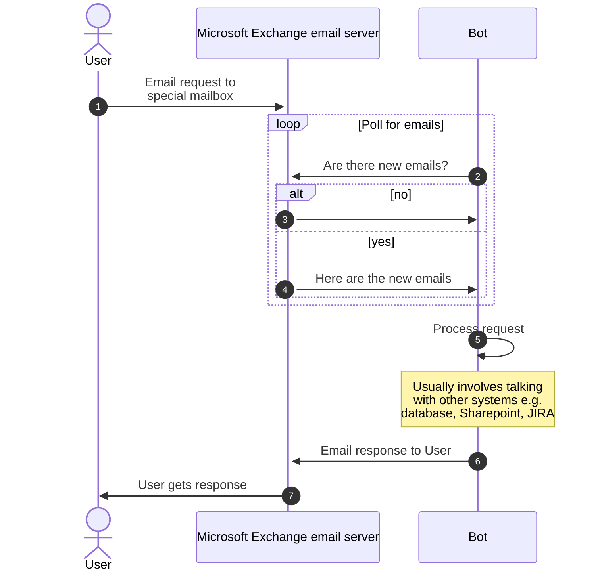

+++
title = "My time as an Application Developer at JPMorgan Chase"
description = ""
tags = [
	"career",
]
date = "2022-09-03"
categories = [
    "",
]
+++

_part of the series [What I do at work](/post/20220831-what-i-do-at-work/)_

## Application Process
I received an offer from JPMorgan Chase (JPMC) by working with my university's career services. At the time I was attending Cornell University as part of the class of 2011, companies were in an escalating race to recruit students earlier and earlier. In the coding world, the ideal path was to intern at Google the summer before your senior year and then, after you finish your internship, to receive a full-time offer to start the summer after your senior year about 10 months later. After that, the next best option was to interview and secure an offer from the Fall Career Fair soon after the semester starts in September. I did not succeed. The final best option was to interview and secure an offer from the Spring Career Fair around February during your final semester. I didn't get that either.

With most offers already extended and accepted, and no more Career Fairs left until my graduation, I had to apply to positions online and hope. About a month before graduation, career services told me JPMC was going to do one more round of interviewing and hiring. I had already gone through JPMC's interview loop, so I assumed they were picking through their back-up options to fill in spots. Lucky me! I received my offer through this last-minute recruitment round.

I was not a strong applicant and would not have received this job offer and the interview opportunities had I not worked with Cornell's career services. Thank you Ivy League privilege.

## The Beginning
The job started with two or three weeks of new-hire training to take care of standard HR training requirements we would have otherwise needed to do individually, to get us onboarded with basic company resources, and to get us pumped up with team-building exercises and company propaganda (see post on [Bureaucratic psychosis](https://experimentalhistory.substack.com/p/bureaucratic-psychosis)). I don't recall much from these training sessions and indeed they were shortened by a week in subsequent years. Some things I do remember:
- the training organizer would play Lady Gaga's new song [The Edge of Glory](https://www.youtube.com/watch?v=QeWBS0JBNzQ) everyday before training started
- as in-coming Technology Analysts, we were told that JPMC was "a technology company with a bank attached" to make the point that JPMC was driven by technology. I naively believed this and later learned it was a lie. JPMC is a bank and finance's needs always come first
- we attended a talk by some Managing Director (a senior management level at finance companies) who spent his session telling personal stories and mean-spirited jokes. It was clear this guy was an asshole. At some point, he started passing around his [Palladium Card](https://en.wikipedia.org/wiki/J.P._Morgan_Reserve_Card) to everyone in the room to impress us. I later learned that the Managing Director in my organization, Alice, was also a big-talking asshole

## Corporate ladder at JPMC

## Work begins
On my first day of real work, I arrived at the office near [Battery Park in New York City](https://en.wikipedia.org/wiki/The_Battery_(Manhattan)) and went to look for my manager, Bob. I eventually found his office but he was not in yet. When he later arrived, he was not expecting me but took my surprise appearance in stride and brought me into his office for a chat. I discovered that JPMC hires technology analysts at the company level and then allocates them to departments and managers, so managers can end up with new analysts that they didn't even ask for. Bob walked me around and introduced me to my teammates Carol, Dave, Erin, and Frank.

Bob was an executive director (ED) that managed an L3 technical support group. At some point, his group created two automation tools creatively referred to as "the Bot" and "the Dashboard". I worked on "the Bot" with Dave and Erin, and Carol worked on "the Dashboard" with Frank. The Bot was originally a way for [Blackberry](https://en.wikipedia.org/wiki/BlackBerry) users to use email to retrieve reports as email attachments instead of having to navigate the intranet on their tiny screens. The Dashboard was originally a way for support technicians to view technology inventory (laptops, cellphones, servers, etc.). Both applications were later expanded beyond their original purposes: the Bot grew into a general-purpose email-based automation tool and the Dashboard acquired the ability to manage inventory.

The five of us application developers didn't fit into a technical support group organizational structure, and so we all reported directly to Bob. It was unusual for analysts to report directly to an executive director, and indeed things changed after about a year and a half:
- Erin and Frank left JPMC
- Dave and Carol transferred to different teams
- I moved under a Vice President who took over ownership of the Bot and Dashboard

I should have taken it as a bad sign when every developer next to me left the group, but I was inexperienced and didn't think much of it. After less than two years, I became the most senior member of my team. For a short while, it was fun being the main cowboy and coding any way I wanted, but it quickly became boring and, in retrospect,  stunted my career growth.

## Technical support levels ([wiki](https://en.wikipedia.org/wiki/Technical_support))
{{<pure_table
  "Level | Responsibilities"
  "L1 | <ul><li>gather customer's information and determine the issue</li><li>handle straightforward and simple problems</li><li>handle 70–80% of problems</li></ul>"
  "L2 | <ul><li>more in-depth technical support level</li><li>technicians are more knowledgeable on the particular product or service</li></ul>"
  "L3 | <ul><li>experts in their fields that handle the most difficult problems</li><li>assist both L1 and L2 personnel</li><li>research and develop solutions to new or unknown issues</li></ul>"
>}}

## The Bot
The main project I worked on at JPMC was an email processor aka “the Bot”. It was written in .NET (originally VB then C#) and SQL Server and was comprised of two components: 
1. an Outlook listener that polled for new mails sent to a particular mailbox and then extracted the sender, email subject, email body, etc
2. custom processing logic with the extracted email components

## Sequence diagram

Dave was the original author of the Bot and wrote the first use-case – sending intranet files to [BlackBerry](https://en.wikipedia.org/wiki/BlackBerry) users. It's hard to navigate websites on a Blackberry and easier to send an email to report-getter@jpmc.com with the subject `Get report xyz` and then receive the report as an attachment. Soon after, he was joined by Erin and the Bot moved beyond its Blackberry origins. By the time I left the team, we had more than ten different internal customers using the tool to:
- watermark documents
- run SQL queries against a database
- send an internal newsletter and manage the distribution list
- manage seat reservations (aka hot desking) after [hurricane Sandy](https://en.wikipedia.org/wiki/Hurricane_Sandy)
- create JIRA tickets
- extract, transform, and load (ETL) emails into a database
- send email campaigns and initiate escalations, e.g. do something by this date or we will email your manager and then your manager's manager, etc.
- send monthly technology inventory emails to every person in the Asset Management (AM) group

## End User Technology (EUT) billing project
The last use-case above was called the EUT project and was responsible for most of the 15,800 distinct users and 116,000 transactions processed in 2012. Every month, we would combine HR, finance, and technology data sources to create an internal technology bill to send to every employee in AM. This project was driven by my organization's MD, Alice, and she pressured managers (and hence employees) to reduce internal support costs by submitting requests to remove items they no longer needed. These items were typically things that users didn't know or forgot about, e.g. unused phone lines, Bloomberg access (very expensive!), etc. After running this project for a few months, Alice had someone from finance extrapolate the cost savings into a "yearly savings" figure of $3M. I pulled the raw numbers for finance to crunch and couldn't see how they got it so high 🤷. Nevertheless, Alice got herself some good publicity with what Dave called our "flagship" product.

It was pretty exciting to work on a project that had strong upper-management support and impacted so many users. I really felt like I was making a difference. The technical side, however, was not as great. My team built an automation product but ironically didn't invest in automating our own manual processes. The list of manual work I had to do and the tribal knowledge in my head steadily accumulated. This later became a huge and unsurmountable problem when I left JPMC and someone else had to do and know what I did and knew. All steps of the EUT bill construction process were manual:
- every month, we would import new HR, finance, and technology tables from various sources into our database and try to merge them into a single table we could use to create user bills. This merge would always fail for various reasons, e.g. HR employee group codes would change, finance charges would be missing or appear differently, new technology charge types would appear and need to be explained or rolled-up
- we had no tests or rigorous ways to evaluate the correctness of the bills we generated. We would just run some manual spot-checks of aggregate numbers and individual invoices. We frequently found minor issues midway and were constantly nervous
- the bill-sending process was a script I would run. We wanted our emails to land at the top of user's inboxes in the morning, and so I sent emails in three batches: America, Europe, Asia. This meant waking up late at night to log-in and run the script
- JPMC's Microsoft Exchange email server would frequently and mysteriously fail to send emails. We would address this by (manually, of course) watching the bill-sending process and re-sending failed emails

The craziness above is a typical experience at a start-up, where developers need to wear many hats, provide good customer experiences at personal expense, and do things as fast as possible, lest the start-up die. This is all fine if you are aware of the trade-offs you are making. Unfortunately, at the time, I couldn't see any alternatives and there wasn't anyone to tell me better.

## Total Cost of Ownership (TCO) project
It was a distant second place, but I also spent a lot of time working on the TCO project. In contrast to the EUT project, there were no glorious moments with TCO. While EUT was a start-up-like experience, TCO was fully a big corporation experience.

Some time ago, a superstar developer named Grace developed an ETL workflow and algorithm to allocate server-level costs to applications. The raw pricing data was only available at the server level, so to get the Total Cost of Ownership (TCO) of running an application, she looked at the chargeable resources (e.g. instance cost, networking, CPU, memory, etc.) for each server and then split them out by each application's relative usage. At least that's what the thousands of lines of Oracle SQL code was supposed to do. The Oracle code needed all the raw data before it could start its data analysis, so Grace used Informatica, an expensive ETL tool, to create a workflow to grab the raw data from various sources, do some transformations, and then dump everything into a single table with a bajillion columns. So TCO was a monthly two-step manual process: first run the Informatica workflow to load the data, then execute the Oracle stored procedures to perform calculations.

Grace handed over ownership of TCO to Heidi, and my manager decided that I would be next in line. His terms were that I would have three months of unlimited time with Heidi to learn how to run TCO. This was a disaster. I considered myself “a Bot developer” and paid no attention to Heidi – she didn't really understand what she was running every month anyway. After three months, it was my turn to run TCO. I asked Heidi for help and she reluctantly gave it over the next few months. As the upstream data sources continued to change, the code slowly broke, and I was unable and unwilling to fix it. The users of the TCO data, whom I never spoke with, had to deal with increasingly broken data. Bad times all around.

## The End
After a year on the job, I suspected I was missing something when Dave, the original author of the Bot, abandoned his treasured creation to transfer to another team. Dave didn't even miss leaving. When I asked him about "all this great business impact we're making", he just shrugged. Erin started out by helping with Bot development, but not long after she began splitting her time with an adjacent L3 support team and soon moved over entirely. This left me by myself as the sole person working on the Bot.

Around this time, a new manager, Ivan, appeared to lead the team. He proactively sought out new use-cases and we began conversations to onboard four other lines of business onto our EUT process. We often disagreed on priorities and fought a lot. Solo development was fine for a short while, but I started burning out with overwork from the ever-increasing burden of existing customers since none of that was automated, overwork from new automation requests, and a feeling of pointlessness arising from doing the same thing for a long time.

I helped Ivan hire a junior developer for me to mentor and to work on the Bot. This was my first time hiring someone and I chose badly. Judy was nice and pleasant to work with, but wasn't able to understand the Bot's architecture and codebase. Granted it was a mess filled with hacks, but it was a small and simple mess, and could be learned from first principles by just reading the code. She struggled to complete tasks independently and this struggle never stopped. After I left JPMC, Judy took over Bot development. I heard that she was fired shortly thereafter and the Bot was probably trashed.

In the end, I had been the biggest fish in my own pond for too long. My team coded as if we were working on a college project and not like professional software developers, and I didn't realize this until later. While I didn't develop as much technically as I should have, my overall job experience was normal. Most of my co-workers were nice people. I learned about corporate life and office politics, the importance of work-life balance, and the shape of post-college life. I was fortunate to have the JPMC brand name on my resume and was able to find my next job fairly quickly.
