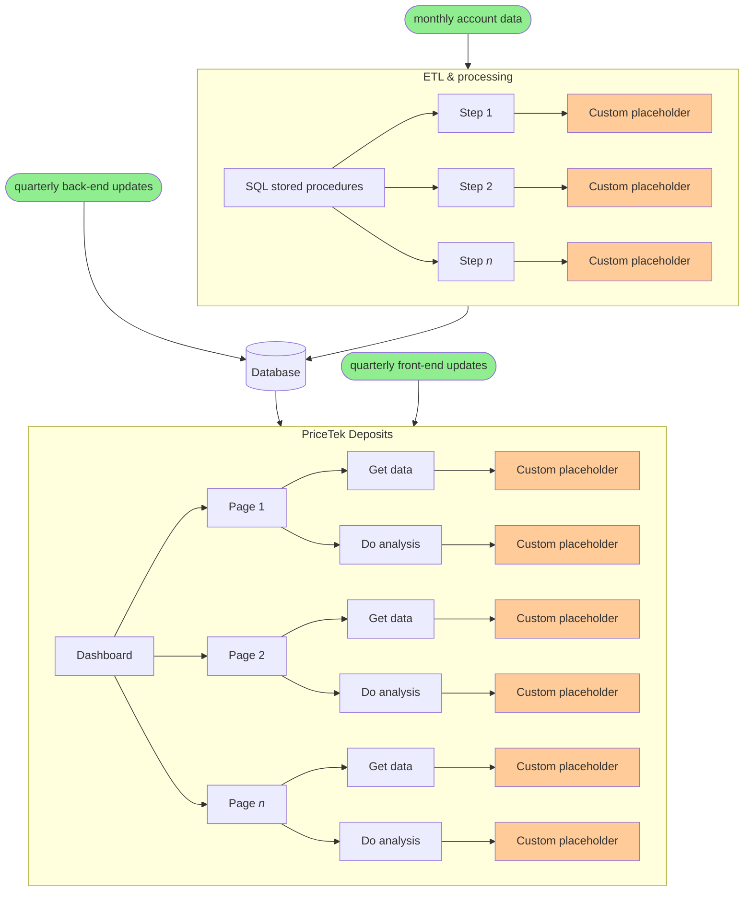

+++
title = "My time as a Database Developer at Novantas"
description = ""
tags = [
	"career",
]
date = "2022-09-04"
categories = [
    "",
]
+++

_part of the series [What I do at work](/post/20220831-what-i-do-at-work/)_

## Overview
At the time I joined, Novantas (now Curinos after [merging with a competitor](https://curinos.com/about-us/)) was a mid-sized financial consulting company that primarily worked with banks to price and analyze their deposit and loan products. A long time ago, Alice the analyst created a massive Excel workbook that to help a client price their deposit products, e.g. savings, checking, CD’s. This workbook became popular and was later ported to a Microsoft SQL Server and Adobe Flex web application and christened PriceTek Deposits. Soon after, PriceTek Loans was also born. Deposits and Loans together grew into half of the company's headcount and Novantas became a strange 50/50 consulting/platform hybrid. I was the first full time SQL developer hire and reported to Alice. With me on the team, Alice could focus on customer sales and relations.

PriceTek Deposits did two major things:
1. Import and transform customer data
1. Visualize customer data and run simulations

Customers gave us data in the form of anonymized monthly balances per account and product. However, they were still interested in cash flows between accounts and products, so Novantas built a complicated tangle of hand-crafted rules to predict cash flows between months. At one point, a study was done to compare the estimated vs actual flows and the error rate was small (~2%) so the rules worked pretty well. Why did the clients force us to estimate cash flows when they could have just given us the actual transaction-level data? I don't remember the official answer, but it was probably for convenience: transaction-level data would have been magnitudes larger and much harder to anonymize. These days, complexity and size are much less of a concern and I wonder if things could have turned out differently. I also wonder if PriceTek Deposits is still alive after the company merged with a competitor…

Alice and some other analysts built the simulation tools. Like most parts of PriceTek, the tricky part was the business logic and not the technical design or writing the SQL. This part of PriceTek didn't change much while I was at Novantas.

Users of PriceTek were typically bank analysts who priced products once a month. They only needed to use PriceTek for a few hours at a time, and this was a huge improvement over their previous work processes. At the time I left in 2019, there were two exciting developments underway:
1. Incorporating big data tools into workflows for faster runtimes
	- The existing cash flow prediction workflows were sequential because subsequent months depended on previous months, e.g. we need to know Bob's checking account balance at the end of January before we can start thinking about flows into and out of his checking account in February. The workflows also took a long time to run. Sometimes, like after making an algorithm change, we needed to re-run the workflows on all of a client's historical data. This would take weeks for the largest clients.
	- At the time this idea was floating around, it was hard to imagine how the existing cash flow workflows could be parallelized to fit into the big data paradigm. Nevertheless, I expect that someone figured it out. The introduction of these big data tools probably also sparked new ideas and methods that weren't possible before.
1. Aggregating and showing industry-level data
    - PriceTek was very successful and had many major banks as customers. We had enough data to show meaningful aggregate trends, such as how the industry was pricing 6-month CD's for the two past years. This would allow our customers to see how they were pricing relative to our other customers. This was a new product idea that management wanted to sell to existing customers and was technically straightforward but legally complicated. When I left, legal negotiations were still in-progress.

## PriceTek Deposits
All of the logic for PriceTek Deposits lived in the database as stored procedures. The front-end was a wrapper that made stored procedure calls to get and display data. While some of clients' custom business logic lived as data in tables (e.g. list of products, algorithm configurations), most of it lived as code in **custom placeholders** scattered everywhere. There was so much custom code that each client's installation of PriceTek was like a separate application. This setup made comprehensive testing impossible and deployment issues frequent. Each quarterly deployment of new front-end and back-end changes required extensive manual testing from the entire team before and after the deployment.

## Projects I worked on

### Drop-down dependencies
Most pages on PriceTek started with a series of drop-downs (DD's) to narrow down the particular products you wanted to look at, e.g. DD1 was Line of Business, DD2 was Product Type, DD3 was Product Subtype, etc. The problem was that each drop-down required its own database call so that selecting a value in a drop-down (e.g. DD1) would trigger a database call to get updated values for the next downstream drop-down (i.e. DD2), and then since _that_ dropdown (i.e. DD2) was just updated then the next downstream drop-down (i.e. DD3) would get triggered and so on. For most clients this behavior was a minor inconvenience that caused a short delay on page load and then a screen flicker every time they selected a drop-down value. However, for our largest client, the delay per DD selection was ~10 seconds and a poor user experience. The solution was just to calculate and return all drop-down values in a single database call. For example, changing DD2 would trigger a single database call that returned the updated values for _all_ downstream dropdowns, i.e. DD3, DD4, etc. I completed this project relatively quickly and there was a big celebration as customers experienced a 10x improvement in DD load speeds.

Then edge cases started popping up because I failed to take into account customer-specific requirements, e.g. custom sort orders and filtering. My design was hard to customize and hacks were required to implement these unforeseen requirements. Instead of sketching a working solution and then jumping into coding, I should have done more design upfront by talking to people, gathering requirements, and getting feedback.

### Deployment improvements
Every three months or so, the entire development team and some people from client services would gather in a room after work, order pizza, and do production deployments for a few hours. Since every customer instance had so much custom code that they were all like different applications, we needed client services on-hand (they wrote the custom code) to help with client-specific issues. Coupled with a broken process to replicate production environments to dry-run deployments beforehand, this meant that every deployment was high risk. Deployments themselves were primarily logic changes in SQL stored procedures and so executed in a few minutes. The reason for the large gathering and late nights was that we had a long manual checklist to work through and often found problems that we needed patch on the spot.

As a consulting company, Novantas's relationship with clients was white-glove and high-touch. The company's approach to building PriceTek was naturally the same and this worked well when there were a few customers. However, by the time I left, we had about 20 customers and running through a checklist 20x was just too much. My main contributions to the deployment process were to make deployment scripts re-runnable and to prepare roll-back scripts for emergencies.

## The End (Parts 1 & 2)
While the consulting side of Novantas seemed cutthroat at times as expected, the PriceTek side was calm and collegial -- Deposits particularly so. This was because of great management and protection by Alice, the manager of and only remaining original developer (there was some drama) of PriceTek Deposits. I still remember a time when I failed to properly test a feature and someone from client services (rightfully) sent an angry email saying that they had to spend several hours late at night fixing a bug and questioning whether I tested properly. Alice immediately called out the hostile tone and brought the three of us together the following day to talk about what happened. Two other examples of Alice helping people:
- fighting to keep our database admin rights when IT (perhaps rightfully) wanted to revoke them even though there hadn't been any problems or abuse
- helping a client services associate transition to a more technical role working on the company's website. She later completed her career change by joining Google as a Software Developer

Though our career paths diverged, I still thank and respect Alice for her technical ability and leadership.

I complained a lot above about PriceTek's technical debt and lack of automation, but I too was contributing to the problem. It's unfair to fault a non-software company for poor software practices, and if _I_ were to do PriceTek Deposits over again today, I would probably do worse.

In the end, I became another big fish in a small pond, just like on my [previous team at JPMC](/post/20220903-jpmorgan-chase). I witnessed the unofficial spin-off of the development half of the company (we were moved to a different building!) and increased hiring of software developers (primarily for big data projects I was not involved with). I helped hire my co-worker, Carol, who was a fantastic developer and perfect successor. If I had stuck around, I could have slowly grown into a development lead-like role, where I would mentor junior developers and help hire senior developers who would in turn mentor me. These new people would bring in new ideas that would solve (or obviate) the existing problems. However, I didn't want to wait and was too tired. I needed a break from work and from feeling like my efforts were pointless because nobody used what I worked on. Though I knew this was not strictly true and was just a symptom of my burn-out, knowing alone is little relief. 

When the CTO, Dave, caught wind that I was resigning, he sat me down for a chat at the fancy bar across the street. This was the end of an era when being a digital nomad (someone who works remotely, travels a lot, and posts photos about how great their life is) was super cool and it was still something that I wished I could try. And so, when Dave asked me how he could convince me to stay, I proposed a 2-month break (negotiated to 1-month) followed by part-time, remote (negotiated to occasional office visits) contract work at some hourly rate that was also negotiated down. I underestimated this demure, smooth-talking man and he convinced me, against my best interests, to continue working at Novantas. My life as a digital nomad comprised of laying in bed for hours dreading work, being unable to concentrate, and delivering low quality work. When my contract ended after 6 months and I finally left, no one tried to stop me.

While I joined Novantas because I liked working with data, I became disturbed that I had forgotten how to code because I was writing SQL everyday. It was only two years prior that I was fluent in C# and I had forgotten all of it. I decided to learn Python next. It was a long, slow, and humbling process to learn how to code again from the beginning. I spent the next few months resting, grinding [LeetCode](https://leetcode.com/) (a website to practice algorithm questions commonly asked during interviews), and working on side projects so I could be a software developer again.
