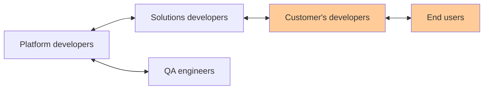
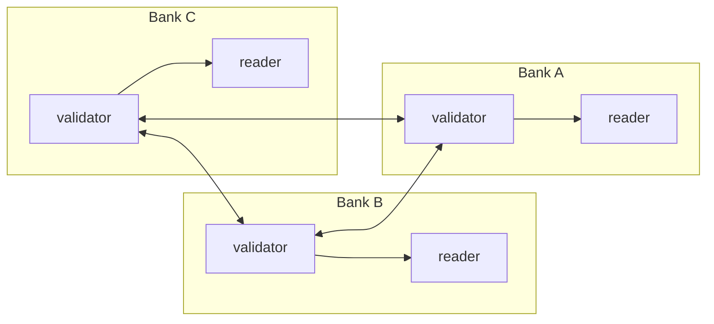

+++
title = "My time as a Software Developer at Axoni"
description = ""
tags = [
  "career",
]
date = "2022-09-05"
categories = [
    "",
]
+++

_part of the series [What I do at work](/post/20220831-what-i-do-at-work/)_

## Application Process
I got started in crypto when my friend, Alice, introduced me to Bitcoin back around 2016. I was drawn in more by the interesting new technology and less by the vision of how it would change the world. Soon after, I worked through the excellent [Bitcoin Coursera](https://www.coursera.org/learn/cryptocurrency), which taught me 95% of what I know about Bitcoin. Alice was interested in starting a Bitcoin ATM business together. We did some research and found that it was possible -- a few others had done so already, ATM machines were available to buy, and the legal status was shakey but looking positive. But it would be expensive -- ATM manufacturers would only sell in bulk and we would need legal services. I decided that I didn't have enough savings and didn't proceed. In retrospect, I should have expected these conditions as an early mover. It's normal for business owners to take out (substantial) loans and the root problem was that my risk appetite was too low.

Given my newfound interest in crypto, I was also applying to crypto start-ups and that was how I found Axoni. I was grateful that Axoni extended me an offer at all because I didn't have much relevant software development experience. Probably, my enthusiasm for Bitcoin, passable whiteboard coding skills, and finance/Cornell pedigree (sadly highly relevant) was sufficient to impress the start-up founders, who still insisted on personally interviewing every potential hire. When I joined Axoni, I had to learn MacOS, bash, Docker, Git, Golang, Ethereum, Solidity, and testing (unit, integration, E2E) -- basically everything. It was a rough first few months. It was exciting to work at a healthily-funded start-up and experience the freedom and the perks. As promised, the perks were quite good:
- catered lunch twice a week
- good office location in the [Flatiron district](https://en.wikipedia.org/wiki/Flatiron_District)
- company swag (banker bag, Patagonia vest after a year when your options "vest")
- annual, multi-day winter and summer trips
- well-stocked pantry

## The company
Axoni was founded by two brothers who got their start in the blockchain space with a popular Bitcoin newsletter. Axoni's main product was AxCore, an Ethereum-based, managed blockchain that traded-off decentralization for performance and more granular data access controls. Axoni's clients were financial firms who needed to share data but inherently didn't trust each other. An example is post-trade settlement between banks. After a trade is conducted, both parties A and B need to reconcile who owes whom and how much, and disagreements often arise. Banks have armies of people whose sole responsibility is post-trade data reconciliation. With a blockchain, parties A and B can skip expensive middlemen, speak directly with each other, and refer to a single authoritative transaction history. They can use a blockchain to do this by agreeing on the exact trade logic (the hard part) and then writing a blockchain contract that automatically executes this logic over time (the easy part).

While Axoni was strong technically, its primary strength was the business and sales team who were able to convince banks to come together and agree on their trade logic. Banks have wanted to automate their manual data reconciliation processes for a long time, and many people have tried and failed to sell them products. This perspective only magnifies Axoni's business achievements -- not only did they succeed where others failed, but they succeeded using new, unproven technology. 

Given that the founders came from a finance background and that Axoni served finance customers, it's no surprise that Axoni was structured like a finance company. Developers were split into two groups: platform and solutions. Platform developers worked on the AxCore blockchain, while solutions developers worked with clients to write smart contracts on the AxCore blockchain. Having an official split between developers came with pros and cons, and a big con was communication. The lack of communication between groups led to us platform developers creating features in isolation. When these new features landed on the solution developer's laps, they had to scramble to address the security implications and general user-unfriendliness of what we had created. It felt great to have the freedom to solve problems independently and then move on, but it was unrealistic and detrimental to other teams and the overall company.

The split between platform and solutions also meant that the platform developers were three levels removed from the actual end user. 

Axoni naturally followed the same software development lifecycle that their customers used: the traditional waterfall model (big infrequent updates) as opposed to the newer [continuous deployment](https://en.wikipedia.org/wiki/Continuous_deployment) (small frequent updates) model. This meant that changes would accumulate until a release version was cut and then the QA team would painstakingly work through a testing checklist to certify the release. The waterfall model inherently discourages developers from taking ownership of testing, which again feels great because they can focus on development but ends up taking more time overall when bugs are found. It's easier to fix problems when the changes are isolated and fresh in your mind, as opposed to when the changes are bundled with many other changes in the release version and are months-old.

It was interesting to watch the company change over time. When I joined in 2017, there were about 40 people: ~20 software developers, ~10 business, ~10 human resources. The environment was relatively low pressure and the company focused on only two client projects, both of which were still in the pre-production phase. Day-to-day priorities were decided by developers. With low management oversight, people worked on what they thought was important or just interesting. This was a good environment for developers to play and learn, but not ideal for the company. For example, one developer, Bob, decided to rewrite one of our blockchain deployment and management tools to use [Kubernetes](https://en.wikipedia.org/wiki/Kubernetes), a new and super hot technology at the time. His rewrite gained some traction but was ultimately thrown away and rewritten again a year later because Kubernetes is hard to learn and nobody asked for it in the first place. I suspect that Bob just wanted to play with and learn Kubernetes. As Axoni grew and eventually hired a manager to wrangle developers, the cowboy days were left behind: you now had to convince your manager to give you time to work on pet projects, which was a small hurdle but one nonetheless. By the time I left in 2020, the company had double to ~80 people, with roughly the same allocation of 50% developers, 25% business, and 25% human resources.

## AxCore sample network

In this simple network, the three bank's validators nodes talk to each other to agree on what transactions go into the next block. This is a _managed_ blockchain, so only trusted parties can participate. AxCore is actually more of a distributed ledger technology (DLT) than a blockchain both in its implementation (no "proof-of" protocol or token) and its lesser importance on the order of the blocks. A Google search ([link](https://www.google.com/search?q=axoni)) shows both terms being used, but Axoni's [own website](https://axoni.com/technology/) has been updated to DLT. Nevertheless, I will continue to use the term _blockchain_.

This architecture is not so different from a normal database, except control is shared amongst multiple parties.

## Minor Projects
Most of the projects I worked on were small and took a few weeks to complete:
- Created first batch of end-to-end (E2E) tests
  - E2E tests, as the name suggests, verify that a process works from start to finish. In our case, it means creating nodes to host the blockchain, publishing the first aka _genesis_ block in the chain, and then creating and executing smart contracts. I did the obvious thing at the time by extending and automating some existing Python scripts for manual testing
  - I believe that this laissez-faire attitude towards E2E testing and testing in general eventually cascaded into months of lost developer productivity. Every development team needs to deal with flakey tests and without senior guidance to warn us otherwise, we took the worst path of normalizing flakiness. By adopting the mantra of "just re-run the test a few times until it works", we signaled to ourselves that subpar code is acceptable and wasted huge amounts of time waiting for reruns
  - I also started a mini language war. Almost every developer on the platform team spent weeks learning Golang, and then had to switch to Python to work on the E2E tests. This became an escalating painpoint and eventually a full rewrite into Golang was planned. I didn't stick around to see how this went, but I expect it went poorly because the language wasn't the main problem -- it was our attitude
- Put genesis contracts in build chain
  - The first aka _genesis_ block comes with special _genesis_ contracts. These contracts rarely changed and so they lived as a hard-coded string of bytecode, i.e. the compiled version of the contracts. However, when someone did want to change them, they had to hunt down the pre-compiled, human-readable version of the contract from various sources. My change here was to remove the hard-coding by committing the source code and then automating the compilation from source code to bytecode
- Prevent duplicate messages from being processed
  - The main idea here was to avoid processing the same message multiple times and make message processing [idempotent](https://en.wikipedia.org/wiki/Idempotence). In other words, a message should be processed exactly once and subsequent requests should just return the original response. There is a nuance here about uniqueness and how to tell when messages are duplicates that I will skip. If I remember correctly, the change was in two places:
    1. Nodes would a maintain a list of recently-processed messages to immediately detect duplicates. This was a fail-fast first check by the first node that touched the request. Though I didn't implement it, this was the perfect use-case for a [bloom filter data structure](https://en.wikipedia.org/wiki/Bloom_filter) -- speed was critical and rare false-negatives were acceptable because there was a second more rigorous check
    1. Validator nodes would check for duplicates before accepting messages as candidates for the next block. As a whole, validator nodes "know everything" (they're responsible for the chain after all) and so can give a definitive answer on whether a message has been seen before

## HSM Project
Hardware security modules (HSM's) are physical devices used to create, store, and use digital keys, i.e. random sequences of data. Keys are used for cryptographic operations like proving ownership and identity, so keeping them safe is mission critical. The use of HSM's for managing keys long predates blockchain -- the communications standard, called [PKCS#11](https://en.wikipedia.org/wiki/PKCS_11), was published back in 1995. The main idea is that (1) the (secret) key never leaves the HSM because all cryptographic operations (encryption, decryption, signing) are performed on the HSM itself and (2) you have a physical device that contains all your secrets that you can physically protect. Of course, these days there are service offerings for everything including HSM's, see AWS's [ CloudHSM](https://aws.amazon.com/cloudhsm) and Google's [Cloud HSM](https://cloud.google.com/kms/docs/hsm). A closely-related concept is a Key Management System (KMS), which is a layer on top of HSM's that provides useful features like auditing, key rotation, etc. KMS's are common knowledge for cloud users because they are used to manage encryption keys, while HMS's are niche because they are comparatively low-level.

The goal of the HSM project was to add HSM support to AxCore. This was a fundamental change that touched every part of the blockchain. All cryptographic operations that were previously done locally now needed to be genericized to allow them to be done remotely. Moreover, AxCore was using the [ECDSA](https://en.wikipedia.org/wiki/Elliptic_Curve_Digital_Signature_Algorithm) cryptography algorithm due to its Ethereum roots. That also needed to be genericized because HSM's allow you to choose what cryptography system you want to use. All kinds of hard-coded assumptions, e.g. the length of keys, needed to be removed and abstracted. In addition to the overhaul and abstraction of cryptographic operations and algorithms, we also needed to abstract our internal representation of a key -- no longer could we just store it as a simple string because now we needed to know what cryptographic algorithm the key is used for. This change in internal data structure meant changing what is stored in a block and hence the serialization and deserialization logic (the process of converting a data structure into bytes so it can be transmitted or stored and vice versa).

This was my first big software development project, and characteristic of big projects, I didn't know how big it was until I was in too deep and started blowing past deadlines. By that point, I had tunnel vision and worked overtime in the wrong direction multiple times. After an exhausting, largely self-imposed, death march, I burned myself out and completed the project. The unnecessary pressure was confirmed when the customer didn't use the feature until several months later, and my burn-out received its finishing touch when my new manager, Carol, gave me a negative performance review.

## The end
I felt like I did Axoni a big favor by working extra hard for four consecutive weekends and Carol's poor performance review was a slap in the face. It was probably driven by upper management because all of my peers thought I did well. Even so, part of a manager's job is to protect their directs from internal politics and Carol failed me. Regardless of whether I deserved the poor review, it drove me away from the company.

My time at Axoni was overall positive and representative of start-up life: smart, young people making stuff fast. I was given more responsibility and learned more than I would have at a larger company. One of the things I learned is that I prefer a more structured work environment and need mentorship from senior developers -- both things not available at a start-up. I was still very junior as a software developer and pointers from more seasoned folks would have saved me a lot of pain. I think this sentiment of "there must be a better way to do this but no one here knows how", particularly around processes and design, was common but largely unspoken amongst the developers. I'm not saying that everyone at Axoni was a fresh grad: the average work experience was say about 5 years. I'm saying that, with a few exceptions on teams I didn't work closely with, there was no one with 15 years of software development experience.

I had wanted to leave finance for some time and to get into pure technology. Business and sales is king at any company, but more-so at companies with finance cultures. Inline with the org chart above, I only had a few interactions with clients' developers and never spoke with the actual end-users. That was fine with me most of the time because customer interactions are exhausting, but zero interaction caused me to lose perspective:
- Did customers like that feature I built last month?
- Is anyone even going to use this?

I was also tired of the constant hype and drama from being in the crypto space. I wanted to learn how to do things _slower_ but _right_. In my next role on a pure technology team, I was able to find _right_ but not _slower_.
